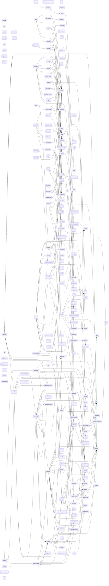

```mermaid
graph LR;
pkg0("aiohttp") --> pkg1 & pkg6 & pkg7 & pkg16 & pkg39 & pkg75 & pkg183;
click pkg0 href "https://github.com/aio-libs/aiohttp";
pkg1("aiosignal") --> pkg39;
click pkg1 href "https://github.com/aio-libs/aiosignal";
pkg2("argon2-cffi") --> pkg3;
pkg3("argon2-cffi-bindings") --> pkg14;
click pkg3 href "https://github.com/hynek/argon2-cffi-bindings";
pkg4("asttokens") --> pkg154;
click pkg4 href "https://github.com/gristlabs/asttokens";
pkg5("astunparse") --> pkg154 & pkg176;
click pkg5 href "https://github.com/simonpercivall/astunparse";
pkg6("async-timeout");
click pkg6 href "https://github.com/aio-libs/async-timeout";
pkg7("attrs");
click pkg7 href "https://www.attrs.org/";
pkg8("backcall");
click pkg8 href "https://github.com/takluyver/backcall";
pkg9("beautifulsoup4") --> pkg155;
click pkg9 href "https://www.crummy.com/software/BeautifulSoup/bs4/";
pkg10("bleach") --> pkg154 & pkg174;
click pkg10 href "https://github.com/mozilla/bleach";
pkg11("branca") --> pkg53;
click pkg11 href "https://github.com/python-visualization/branca";
pkg12("bs4") --> pkg9;
click pkg12 href "https://pypi.python.org/pypi/beautifulsoup4";
pkg13("certifi");
click pkg13 href "https://certifiio.readthedocs.io/en/latest/";
pkg14("cffi") --> pkg111;
click pkg14 href "http://cffi.readthedocs.org";
pkg15("chardet");
click pkg15 href "https://github.com/chardet/chardet";
pkg16("charset-normalizer");
click pkg16 href "https://github.com/ousret/charset_normalizer";
pkg17("click") --> pkg18;
click pkg17 href "https://palletsprojects.com/p/click/";
pkg18("colorama");
click pkg18 href "https://github.com/tartley/colorama";
pkg19("commonmark");
click pkg19 href "https://github.com/rtfd/commonmark.py";
pkg20("comtypes");
click pkg20 href "https://github.com/enthought/comtypes";
pkg21("cppimport") --> pkg66 & pkg110;
click pkg21 href "https://github.com/tbenthompson/cppimport";
pkg22("cupy-cuda102") --> pkg35 & pkg85;
click pkg22 href "https://cupy.dev/";
pkg23("cycler");
click pkg23 href "https://github.com/matplotlib/cycler";
pkg24("debugpy");
click pkg24 href "https://aka.ms/debugpy";
pkg25("decorator");
click pkg25 href "https://github.com/micheles/decorator";
pkg26("defusedxml");
click pkg26 href "https://github.com/tiran/defusedxml";
pkg27("dill");
click pkg27 href "https://github.com/uqfoundation/dill";
pkg28("docutils");
click pkg28 href "http://docutils.sourceforge.net/";
pkg29("elkai");
click pkg29 href "https://github.com/filipArena/elkai";
pkg30("entrypoints");
click pkg30 href "https://github.com/takluyver/entrypoints";
pkg31("et-xmlfile");
click pkg31 href "https://foss.heptapod.net/openpyxl/et_xmlfile";
pkg32("execpp") --> pkg21 & pkg145;
pkg33("executing");
click pkg33 href "https://github.com/alexmojaki/executing";
pkg34("fastjsonschema");
click pkg34 href "https://github.com/seznam/python-fastjsonschema";
pkg35("fastrlock");
click pkg35 href "https://github.com/scoder/fastrlock";
pkg36("flask") --> pkg17 & pkg44 & pkg51 & pkg53 & pkg175;
click pkg36 href "https://palletsprojects.com/p/flask";
pkg37("folium") --> pkg11 & pkg53 & pkg85 & pkg141;
click pkg37 href "https://github.com/python-visualization/folium";
pkg38("fonttools");
click pkg38 href "http://github.com/fonttools/fonttools";
pkg39("frozenlist");
click pkg39 href "https://github.com/aio-libs/frozenlist";
pkg40("gol-simulator") --> pkg84 & pkg85;
click pkg40 href "https://github.com/HellOwhatAs/GOL_Simulator";
pkg41("idna");
click pkg41 href "https://github.com/kjd/idna";
pkg42("imageio") --> pkg85 & pkg98;
click pkg42 href "https://github.com/imageio/imageio";
pkg43("imageio-ffmpeg");
click pkg43 href "https://github.com/imageio/imageio-ffmpeg";
pkg44("importlib-metadata") --> pkg184;
click pkg44 href "https://github.com/python/importlib_metadata";
pkg45("importlib-resources") --> pkg184;
click pkg45 href "https://github.com/python/importlib_resources";
pkg46("ipykernel") --> pkg24 & pkg48 & pkg56 & pkg69 & pkg79 & pkg89 & pkg107 & pkg165 & pkg167;
click pkg46 href "https://ipython.org";
pkg47("ipympl") --> pkg48 & pkg49 & pkg50 & pkg68 & pkg85 & pkg98 & pkg167;
click pkg47 href "http://matplotlib.org";
pkg48("ipython") --> pkg8 & pkg18 & pkg25 & pkg52 & pkg69 & pkg97 & pkg105 & pkg118 & pkg151 & pkg157 & pkg167;
click pkg48 href "https://ipython.org";
pkg49("ipython-genutils");
click pkg49 href "http://ipython.org";
pkg50("ipywidgets") --> pkg46 & pkg48 & pkg49 & pkg60 & pkg78 & pkg167 & pkg177;
click pkg50 href "http://ipython.org";
pkg51("itsdangerous");
click pkg51 href "https://palletsprojects.com/p/itsdangerous/";
pkg52("jedi") --> pkg95;
click pkg52 href "https://github.com/davidhalter/jedi";
pkg53("jinja2") --> pkg67;
click pkg53 href "https://palletsprojects.com/p/jinja/";
pkg54("jsonschema") --> pkg7 & pkg45 & pkg124;
click pkg54 href "https://github.com/Julian/jsonschema";
pkg55("jupyter") --> pkg46 & pkg50 & pkg57 & pkg77 & pkg81 & pkg138;
click pkg55 href "http://jupyter.org";
pkg56("jupyter-client") --> pkg30 & pkg58 & pkg79 & pkg127 & pkg137 & pkg165 & pkg167;
click pkg56 href "https://jupyter.org";
pkg57("jupyter-console") --> pkg46 & pkg48 & pkg56 & pkg105 & pkg118;
click pkg57 href "https://jupyter.org";
pkg58("jupyter-core") --> pkg133 & pkg167;
click pkg58 href "https://jupyter.org";
pkg59("jupyterlab-pygments");
click pkg59 href "https://github.com/jupyterlab/jupyterlab_pygments";
pkg60("jupyterlab-widgets");
click pkg60 href "https://github.com/jupyter-widgets/ipywidgets";
pkg61("keyring") --> pkg44 & pkg134;
click pkg61 href "https://github.com/jaraco/keyring";
pkg62("kiwisolver");
click pkg62 href "https://github.com/nucleic/kiwi";
pkg63("lazyedge") --> pkg12 & pkg141 & pkg149;
click pkg63 href "https://github.com/HellOwhatAs/lazyEdge";
pkg64("llvmlite");
click pkg64 href "http://llvmlite.readthedocs.io";
pkg65("lxml");
click pkg65 href "https://lxml.de/";
pkg66("mako") --> pkg67;
click pkg66 href "https://www.makotemplates.org/";
pkg67("markupsafe");
click pkg67 href "https://palletsprojects.com/p/markupsafe/";
pkg68("matplotlib") --> pkg23 & pkg38 & pkg62 & pkg85 & pkg89 & pkg98 & pkg120 & pkg127;
click pkg68 href "https://matplotlib.org";
pkg69("matplotlib-inline") --> pkg167;
click pkg69 href "https://github.com/ipython/matplotlib-inline";
pkg70("mistune");
click pkg70 href "https://github.com/lepture/mistune";
pkg71("mouseinfo") --> pkg122;
click pkg71 href "https://github.com/asweigart/mouseinfo";
pkg72("moviepy") --> pkg25 & pkg42 & pkg43 & pkg85 & pkg85 & pkg103 & pkg141 & pkg166;
click pkg72 href "https://zulko.github.io/moviepy/";
pkg73("mpld3") --> pkg53 & pkg68;
click pkg73 href "http://mpld3.github.com";
pkg74("mpmath");
click pkg74 href "http://mpmath.org/";
pkg75("multidict");
click pkg75 href "https://github.com/aio-libs/multidict";
pkg76("nbclient") --> pkg56 & pkg78 & pkg79 & pkg167;
click pkg76 href "https://jupyter.org";
pkg77("nbconvert") --> pkg9 & pkg10 & pkg26 & pkg30 & pkg53 & pkg58 & pkg59 & pkg67 & pkg70 & pkg76 & pkg78 & pkg89 & pkg94 & pkg118 & pkg161 & pkg167;
click pkg77 href "https://jupyter.org";
pkg78("nbformat") --> pkg34 & pkg54 & pkg58 & pkg167;
click pkg78 href "http://jupyter.org";
pkg79("nest-asyncio");
click pkg79 href "https://github.com/erdewit/nest_asyncio";
pkg80("networkx");
click pkg80 href "https://networkx.org/";
pkg81("notebook") --> pkg2 & pkg46 & pkg49 & pkg53 & pkg56 & pkg58 & pkg77 & pkg78 & pkg79 & pkg104 & pkg137 & pkg150 & pkg160 & pkg165 & pkg167;
click pkg81 href "http://jupyter.org";
pkg82("npyscreen");
click pkg82 href "http://www.npcole.com/npyscreen/";
pkg83("nuitka");
click pkg83 href "https://nuitka.net";
pkg84("numba") --> pkg64 & pkg85 & pkg151;
click pkg84 href "https://numba.pydata.org";
pkg85("numpy");
click pkg85 href "https://www.numpy.org";
pkg86("oauthlib");
click pkg86 href "https://github.com/oauthlib/oauthlib";
pkg87("opencv-python") --> pkg85;
click pkg87 href "https://github.com/skvark/opencv-python";
pkg88("openpyxl") --> pkg31;
click pkg88 href "https://openpyxl.readthedocs.io";
pkg89("packaging") --> pkg120;
click pkg89 href "https://github.com/pypa/packaging";
pkg90("panda3d");
click pkg90 href "https://www.panda3d.org/";
pkg91("panda3d-gltf") --> pkg90 & pkg92;
click pkg91 href "https://github.com/Moguri/panda3d-gltf";
pkg92("panda3d-simplepbr") --> pkg90;
click pkg92 href "https://github.com/Moguri/panda3d-simplepbr";
pkg93("pandas") --> pkg85 & pkg127 & pkg130;
click pkg93 href "https://pandas.pydata.org";
pkg94("pandocfilters");
click pkg94 href "http://github.com/jgm/pandocfilters";
pkg95("parso");
click pkg95 href "https://github.com/davidhalter/parso";
pkg96("pdf2image") --> pkg98;
click pkg96 href "https://github.com/Belval/pdf2image";
pkg97("pickleshare");
click pkg97 href "https://github.com/pickleshare/pickleshare";
pkg98("pillow");
click pkg98 href "https://python-pillow.org";
pkg99("pip");
click pkg99 href "https://pip.pypa.io/";
pkg100("pkginfo");
click pkg100 href "https://code.launchpad.net/~tseaver/pkginfo/trunk";
pkg101("ply");
click pkg101 href "http://www.dabeaz.com/ply/";
pkg102("prettytable") --> pkg173;
click pkg102 href "https://github.com/jazzband/prettytable";
pkg103("proglog") --> pkg166;
pkg104("prometheus-client");
click pkg104 href "https://github.com/prometheus/client_python";
pkg105("prompt-toolkit") --> pkg173;
click pkg105 href "https://github.com/prompt-toolkit/python-prompt-toolkit";
pkg106("proxy-tools");
click pkg106 href "http://github.com/jtushman/proxy_tools";
pkg107("psutil");
click pkg107 href "https://github.com/giampaolo/psutil";
pkg108("pure-eval");
click pkg108 href "http://github.com/alexmojaki/pure_eval";
pkg109("pyautogui") --> pkg71 & pkg117 & pkg119 & pkg125 & pkg129;
click pkg109 href "https://github.com/asweigart/pyautogui";
pkg110("pybind11");
click pkg110 href "https://github.com/pybind/pybind11";
pkg111("pycparser");
click pkg111 href "https://github.com/eliben/pycparser";
pkg112("pycryptodome");
click pkg112 href "https://www.pycryptodome.org";
pkg113("pycryptodomex");
click pkg113 href "https://www.pycryptodome.org";
pkg114("pyecharts") --> pkg53 & pkg102 & pkg153;
click pkg114 href "https://github.com/pyecharts/pyecharts";
pkg115("pyexecjs") --> pkg154;
click pkg115 href "https://github.com/doloopwhile/PyExecJS";
pkg116("pygame");
click pkg116 href "https://www.pygame.org";
pkg117("pygetwindow") --> pkg123;
click pkg117 href "https://github.com/asweigart/pygetwindow";
pkg118("pygments");
click pkg118 href "https://pygments.org/";
pkg119("pymsgbox");
click pkg119 href "https://github.com/asweigart/pymsgbox";
pkg120("pyparsing");
pkg121("pypdf2") --> pkg170;
click pkg121 href "https://pypdf2.readthedocs.io/en/latest/";
pkg122("pyperclip");
click pkg122 href "https://github.com/asweigart/pyperclip";
pkg123("pyrect");
click pkg123 href "https://github.com/asweigart/pyrect";
pkg124("pyrsistent");
click pkg124 href "http://github.com/tobgu/pyrsistent/";
pkg125("pyscreeze") --> pkg98;
click pkg125 href "https://github.com/asweigart/pyscreeze";
pkg126("pytesseract") --> pkg89 & pkg98;
click pkg126 href "https://github.com/madmaze/pytesseract";
pkg127("python-dateutil") --> pkg154;
click pkg127 href "https://github.com/dateutil/dateutil";
pkg128("pythonnet") --> pkg111;
click pkg128 href "https://pythonnet.github.io/";
pkg129("pytweening");
click pkg129 href "https://github.com/asweigart/pytweening";
pkg130("pytz");
click pkg130 href "http://pythonhosted.org/pytz";
pkg131("pywebview") --> pkg106 & pkg128;
click pkg131 href "https://github.com/r0x0r/pywebview";
pkg132("pywifi");
click pkg132 href "https://github.com/awkman/pywifi";
pkg133("pywin32");
click pkg133 href "https://github.com/mhammond/pywin32";
pkg134("pywin32-ctypes");
click pkg134 href "https://github.com/enthought/pywin32-ctypes";
pkg135("pywinpty");
pkg136("pywmma") --> pkg180;
pkg137("pyzmq");
click pkg137 href "https://pyzmq.readthedocs.org";
pkg138("qtconsole") --> pkg46 & pkg49 & pkg56 & pkg58 & pkg118 & pkg137 & pkg139 & pkg167;
click pkg138 href "http://jupyter.org";
pkg139("qtpy") --> pkg89;
click pkg139 href "https://github.com/spyder-ide/qtpy";
pkg140("readme-renderer") --> pkg10 & pkg28 & pkg118;
click pkg140 href "https://github.com/pypa/readme_renderer";
pkg141("requests") --> pkg13 & pkg15 & pkg41 & pkg171;
click pkg141 href "https://requests.readthedocs.io";
pkg142("requests-toolbelt") --> pkg141;
click pkg142 href "https://toolbelt.readthedocs.org";
pkg143("rfc3986");
click pkg143 href "http://rfc3986.readthedocs.io";
pkg144("rich") --> pkg19 & pkg118 & pkg170;
click pkg144 href "https://github.com/willmcgugan/rich";
pkg145("robotpy-cppheaderparser") --> pkg101;
click pkg145 href "https://github.com/robotpy/robotpy-cppheaderparser";
pkg146("scikit-opt") --> pkg85 & pkg147;
click pkg146 href "https://github.com/guofei9987/scikit-opt";
pkg147("scipy") --> pkg85;
click pkg147 href "https://www.scipy.org";
pkg148("screeninfo");
click pkg148 href "https://github.com/rr-/screeninfo";
pkg149("selenium") --> pkg171;
click pkg149 href "https://github.com/SeleniumHQ/selenium/";
pkg150("send2trash");
click pkg150 href "https://github.com/arsenetar/send2trash";
pkg151("setuptools");
click pkg151 href "https://github.com/pypa/setuptools";
pkg152("shellescape");
click pkg152 href "https://github.com/chrissimpkins/shellescape";
pkg153("simplejson");
click pkg153 href "https://github.com/simplejson/simplejson";
pkg154("six");
click pkg154 href "https://github.com/benjaminp/six";
pkg155("soupsieve");
pkg156("sourceinspect") --> pkg27;
pkg157("stack-data") --> pkg4 & pkg33 & pkg108;
click pkg157 href "http://github.com/alexmojaki/stack_data";
pkg158("sympy") --> pkg74;
click pkg158 href "https://sympy.org";
pkg159("taichi") --> pkg5 & pkg18 & pkg85 & pkg144 & pkg156;
click pkg159 href "https://github.com/taichi-dev/taichi";
pkg160("terminado") --> pkg135 & pkg165;
click pkg160 href "https://github.com/jupyter/terminado";
pkg161("tinycss2") --> pkg174;
pkg162("torch") --> pkg170;
click pkg162 href "https://pytorch.org/";
pkg163("torchaudio") --> pkg162;
click pkg163 href "https://github.com/pytorch/audio";
pkg164("torchvision") --> pkg85 & pkg98 & pkg162;
click pkg164 href "https://github.com/pytorch/vision";
pkg165("tornado");
click pkg165 href "http://www.tornadoweb.org/";
pkg166("tqdm") --> pkg18;
click pkg166 href "https://tqdm.github.io";
pkg167("traitlets");
click pkg167 href "https://github.com/ipython/traitlets";
pkg168("ttkbootstrap") --> pkg98;
click pkg168 href "https://github.com/israel-dryer/ttkbootstrap";
pkg169("twine") --> pkg18 & pkg44 & pkg61 & pkg100 & pkg140 & pkg141 & pkg142 & pkg143 & pkg166 & pkg171;
click pkg169 href "https://twine.readthedocs.io/";
pkg170("typing-extensions");
pkg171("urllib3");
click pkg171 href "https://urllib3.readthedocs.io/";
pkg172("ursina") --> pkg90 & pkg91 & pkg98 & pkg122 & pkg148;
click pkg172 href "https://github.com/pokepetter/ursina";
pkg173("wcwidth");
click pkg173 href "https://github.com/jquast/wcwidth";
pkg174("webencodings");
click pkg174 href "https://github.com/SimonSapin/python-webencodings";
pkg175("werkzeug");
click pkg175 href "https://palletsprojects.com/p/werkzeug/";
pkg176("wheel");
click pkg176 href "https://github.com/pypa/wheel";
pkg177("widgetsnbextension") --> pkg81;
click pkg177 href "http://ipython.org";
pkg178("windnd");
click pkg178 href "https://pypi.org/project/windnd/";
pkg179("windows-curses");
click pkg179 href "https://github.com/zephyrproject-rtos/windows-curses";
pkg180("wolframclient") --> pkg0 & pkg13 & pkg85 & pkg86 & pkg130 & pkg137 & pkg141;
click pkg180 href "https://www.wolfram.com/";
pkg181("wwolframclient") --> pkg48 & pkg166 & pkg180;
click pkg181 href "https://github.com/HellOwhatAs/wolframclient";
pkg182("yapf");
pkg183("yarl") --> pkg41 & pkg75;
click pkg183 href "https://github.com/aio-libs/yarl/";
pkg184("zipp");
click pkg184 href "https://github.com/jaraco/zipp";
pkg185("zmq") --> pkg137;
click pkg185 href "https://github.com/zeromq/pyzmq";
```